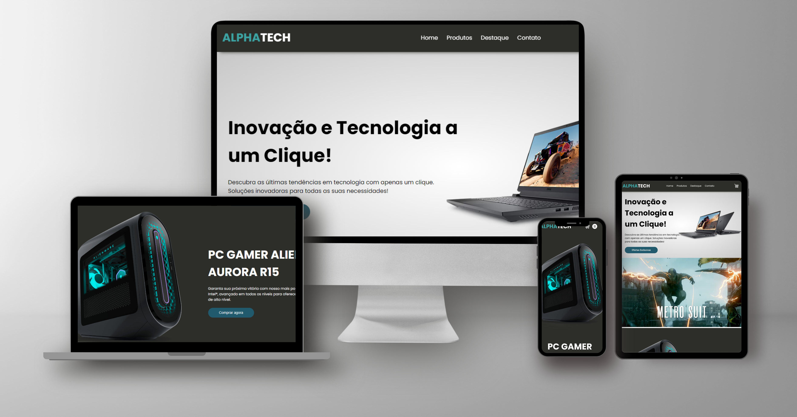

# AlphaTech E-commerce

[AlphaTech E-commerce](https://alphatech-ecommecer.vercel.app/)<br>



## Descrição

AlphaTech é uma plataforma de e-commerce moderna e inovadora, desenvolvida com HTML, CSS e JavaScript. 
Nosso objetivo é oferecer uma experiência de compra online perfeita e intuitiva, destacando os melhores produtos tecnológicos disponíveis no mercado. 


<video autoplay loop src="assets/video-alpha-tech.mp4" type="video/mp4">

## Funcionalidades

- **Navegação Intuitiva**: Layout claro e simples para facilitar a navegação dos usuários.
- **Catálogo de Produtos**: Exibição de uma vasta gama de produtos tecnológicos com descrições detalhadas.
- **Carrinho de Compras**: Sistema de adição e remoção de produtos do carrinho com atualização em tempo real.
- **Filtro de Produtos**: Filtragem de produtos por categorias para encontrar facilmente o que o usuário procura.
- **Responsividade**: Design responsivo que se adapta a diferentes dispositivos e tamanhos de tela.
- **Checkout Simples**: Processo de compra simplificado para uma experiência de usuário fluida.

## Diferenciais

- **Design Moderno**: Interface atraente e moderna que proporciona uma experiência visual agradável.
- **Performance**: Carregamento rápido e eficiente, garantindo uma experiência de usuário sem interrupções.
- **Usabilidade**: Foco na experiência do usuário com funcionalidades intuitivas e fáceis de usar.
- **SEO Amigável**: Estrutura otimizada para mecanismos de busca, garantindo melhor visibilidade online.

## Tecnologias Utilizadas

- **HTML5**: Estrutura semântica do site.
- **CSS3**: Estilização avançada para um design moderno e responsivo.
- **JavaScript**: Funcionalidades dinâmicas e interativas.

## Como Executar o Projeto

1. Clone o repositório:
   ```bash
   git clone https://github.com/seuusuario/alphatech-ecommecer.git
   ```

2. Navegue até o diretório do projeto:
   ```bash
   cd alphatech-ecommecer
   ```

3. Abra o arquivo `index.html` no seu navegador preferido.

## Contribuição

Contribuições são bem-vindas! Sinta-se à vontade para abrir issues e pull requests para melhorias e correções.

## Licença

Este projeto está licenciado sob a Licença MIT - veja o arquivo [LICENSE](LICENSE) para mais detalhes.

## Contato

Para mais informações, entre em contato:
- **Email**: valdezjulian.tab@gmail.com
- **LinkedIn**:([https://www.linkedin.com/in/seuperfil/](https://www.linkedin.com/in/valdezjulian/))
